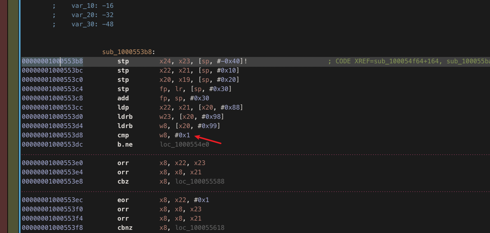
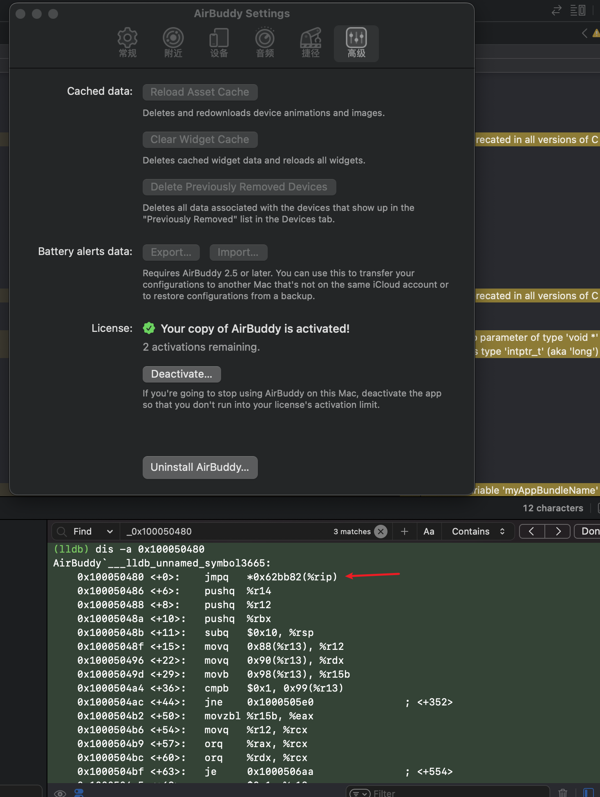
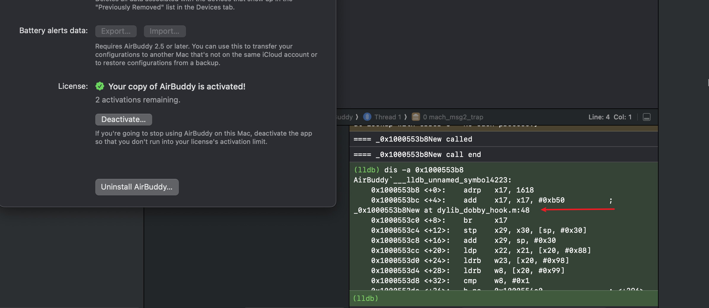

## 前记
xcode 开发 dylib , 基于跨平台的 dobby HOOK 框架来构建跨平台的通杀补丁.  
你妈再也不用担心你只能跑 Rosetta 了..  

开发环境: 
- xcode
- dobby
- insert_dylib
- hopper | ida

## 项目搭建

1. xcode 新建一个 MacOS > Library 项目

稍微做一些配置:
-- 关掉代码优化: Optimization Level -> None 
这个东西开了的话 hook 或者 写内联汇编会出问题

-- 跨平台构建打开: Build Active Architecture Only > No 
这个东西开了的话, m系列代码 编译出来的 x86/arm 都可以用,跨平台必备

2. 项目中引入 dobby 动态库 < libdobby.dylib >, 并且 引入 dobby.h 头文件

3. 编写 hook 代码


## hook 代码
先根据 系统架构宏 写个判断  
```
#if defined(__arm64__) || defined(__aarch64__)
// 此处写 arm hook 代码

#elif defined(__x86_64__)
// 此处写 x86_64 hook 代码

#endif

+ (void) load {    
    NSString *appName = [[NSBundle mainBundle] bundleIdentifier];
    const char *myAppBundleName = [appName UTF8String];
    
    NSAlert *alert = [[NSAlert alloc] init];
    [alert setMessageText:@"确认执行破解操作吗？"];
    [alert addButtonWithTitle:@"确认"];
    [alert addButtonWithTitle:@"取消"];
    NSInteger response = [alert runModal];
    
    if (response == NSAlertFirstButtonReturn) {
        // 用户选择了确认按钮
        // AirBuddy();
    } else {
        // 用户选择了取消按钮
        return;
    }
}
```


关键 hook 函数,见帖子 :
https://www.52pojie.cn/thread-1739112-1-1.html  

该帖子里已知,x86_64 下函数 0x100050480 中 r13+99h 来判断是否已注册  
帖子中的 hook 框架 rd_router 只能在 x86下 使用, 我们替换成 dobby 写法  
macos 逆向 ,我接触的不多, 原帖计算函数地址用到了 _dyld_get_image_vmaddr_slide 方法,   
我配置 xcode dylib 直接启动 run with app 的话, 需要把_dyld_get_image_vmaddr_slide 删掉, 不知道为啥,..


```
#elif defined(__x86_64__)

int _0x100050480New() {
    NSLog(@"==== _0x100050480New called");
    __asm
    {  
        mov byte ptr[r13+99h], 0
    }
    NSLog(@"==== _0x100050480New call end");
    return _0x100050480Ori();
}

void AirBuddy() {
    NSLog(@"The current app running environment is __x86_64__");
    intptr_t _0x100050480 =  _dyld_get_image_vmaddr_slide() + 0x100050480;
    DobbyHook(_0x100050480, _0x100050480New, (void *)&_0x100050480Ori);
    NSLog(@"_0x100050480 >> %p",_0x100050480);
}
#endif
```

用同样的方法, 我们用 hopper 或者 ida 找到 arm 下的目标函数。



可以看到 , 函数地址为: 0x1000553b8  
并且由 x20+99h 来判断是否已注册, hook 代码如下:  
wzr 是一个特殊的寄存器，表示零寄存器，它的值始终为0。  
通过将 wzr 寄存器的值存储到[x20, #0x99]内存地址处


```
#if defined(__arm64__) || defined(__aarch64__)

int _0x1000553b8New() {
    // r20 + 0x99 != 0x1
    NSLog(@"==== _0x1000553b8New called");
    __asm__ __volatile__(
       "strb wzr, [x20, #0x99]"
     );
    NSLog(@"==== _0x1000553b8New call end");
    return _0x1000553b8Ori();
}

void AirBuddy() {
    NSLog(@"The current app running environment is __arm64__");
    intptr_t _0x1000553b8 = _dyld_get_image_vmaddr_slide() + 0x1000553b8;
    DobbyHook(_0x1000553b8, _0x1000553b8New, (void *)&_0x1000553b8Ori);
    NSLog(@"_0x1000553b8 >> %p",_0x1000553b8);
    
}
#elif defined(__x86_64__)
```

## build 注入

编译后, 会得到一个我们的 dylib 补丁  
然后编写 shell 脚本,来注入  

```shell
current_path=$PWD
echo "当前路径：$current_path"

app_name="AirBuddy"

dylib_name="dylib_dobby_hook"
prefix="lib"

insert_dylib="${current_path}/../tools/insert_dylib"

# 我们的 release 补丁路径
BUILT_PRODUCTS_DIR="${current_path}/../Release"

app_bundle_path="/Applications/${app_name}.app/Contents/MacOS/"

cp -f "${insert_dylib}" "${app_bundle_path}/"   

app_bundle_framework="/Applications/${app_name}.app/Contents/Frameworks"
app_executable_path="${app_bundle_path}/${app_name}"
app_executable_backup_path="${app_executable_path}_Backup"

# 第一次注入的之后备份源文件
if [ ! -f "$app_executable_backup_path" ]; 
then
    cp "$app_executable_path" "$app_executable_backup_path"
fi


# 把补丁 与 补丁依赖的 dobby hook 框架都复制到目标程序下
cp -R "${BUILT_PRODUCTS_DIR}/${prefix}${dylib_name}.dylib" ${app_bundle_framework}
cp -R "${BUILT_PRODUCTS_DIR}/libdobby.dylib" ${app_bundle_framework}

# 用 insert_dylib 来向目标程序注入
"${app_bundle_path}/insert_dylib" --weak --all-yes "@rpath/${prefix}${dylib_name}.dylib" "$app_executable_backup_path" "$app_executable_path"

```


效果如下:
### x86_64


### arm  
arm hook 的汇编代码怎么感觉看着有点奇怪 ??  




## Ref
1. [MacOS逆向] AirBuddy2 2.6.3 的dylib注入方案 (2) https://www.52pojie.cn/thread-1739112-1-1.html
2. [C&C++ 原创] C++ 跨平台 内联汇编集成 (MacOS,Linux,Windows) https://www.52pojie.cn/thread-1653689-1-1.html
3. jmpews/Dobby https://github.com/jmpews/Dobby


## Release

项目已经打包 github,可以直接用 xcode 打开 :
https://github.com/marlkiller/dylib_dobby_hook  

目录:
1. libs:  项目依赖的开源 dobby 库
2. release:  build 后的成品
3. script:  里面有个 hack.sh, 可以直接sudo sh 执行一键注入脚本
4. tools: insert_dylib 开源注入工具


